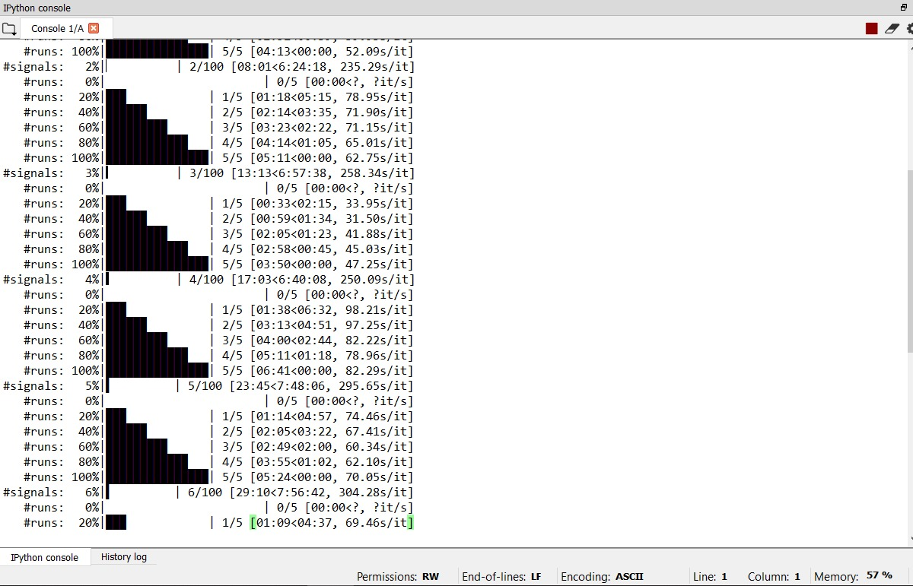

# Automatic Programming of Synthesizer for Sound Matching Using Evolutionary Algorithms

## Description
This repository contains the code of the project for the NWI-IMC042
Natural Computing course at Radboud University (2019-2020).

## Structure
This project has the following file structure:
* [`logs/`](logs/): contains the `.json`-format log files that were generated in the experiments we ran.
* [`plots`](plots/): will be created by the [`src/plotting.py`](src/plotting.py) file to store all the generated plots.
* [`src/`](src/): contains the source code for the project.
  * [`binary_ga.py`](src/binary_ga.py): contains functions for executing the genetic algorithm with the binary representation of individuals
  * [`categorical_ga.py`](src/categorical_ga.py): contains functions for executing the genetic algorithm with the categorical representation of individuals
  * [`logger.py`](src/logger.py): contains code for generating the logs of the experiments that we performed in our project. The generated logs are saved to [`logs/`](logs/).
  * [`plotting.py`](src/plotting.py): contains functions for creating plots with the data in [`logs/`](logs/) and saves them to [`plots/`](plots/). In contrast to the other files, the functions in this file are not part of the pipeline. Therefore, this file needs to be ran by itself. Further details will be given in the section _How to Run_.
  * [`run_experiment.py`](src/run_experiment.py): contains the main pipeline for this project. This file can be called from the command line which will be explained in the _How to Run_ section.
  * [`synth.py`](src/synth.py): contains the `Synth` class necessary to generate sound signals.
  * [`target.py`](src/target.py): contains the code for a generator that generates the target sound signals to be approximated during the experiments.
  * [`utils.py`](src/utils.py): contains random utility functions that did not fit elsewhere.

## How to Run
The project was built for Python 3. The main pipeline of the project can be called from the command line with the `run_experiment.py` file. In our project we conducted two experiments: hyperparameter optimisation and comparison of representations (between binary and categorical).

### Hyperparameter Optimisation
We conducted an experiment to optimal hyperparameters with a small grid search. For both representations, we tested all possible combinations of mating probabilities [0.3, 0.5, 0.7] and mutation probabilities [0.1, 0.2, 0.3]. This experiment can be recreated with the following commands (given that no changes were made to the default parameters):
```bash
cd src
python3 run_experiment.py -gene "binary" "categorical" -mp 0.1 0.2 0.3 -cp 0.3 0.5 0.7 
```
The complete command without relying on the default parameters is as follows:
```bash
cd src
python3 run_experiment.py -gene "binary" "categorical" -mp 0.1 0.2 0.3 -cp 0.3 0.5 0.7 -es 2 -ts 1337 -e 10 -p 50 -g 30 -t 3 -ntargets 20 -nruns 5
```
Note that this might take a long time to complete. Instead you might want to run configurations separately. This can be done by dividing the statement above in different parts. This will not matter for random number generation, since the seed is reset after one configuration has been executed.

### Comparison of Representations
Using the optimal hyperparameters found with the commands in the previous subsection we compared the binary representation to the categorical representation. This experiment can be recreated with the following commands (given that no changes were made to the default parameters):
```bash
cd src
python3 run_experiment.py -gene "binary" -mp 0.3 -cp 0.7 -ntargets 100 -ts 2
python3 run_experiment.py -gene "categorical" -mp 0.3 -cp 0.5 -ntargets 100 -ts 2
```
The complete command without relying on the default parameters is as follows:
```bash
cd src
python3 run_experiment.py -gene "binary" -mp 0.3 -cp 0.7 -ntargets 100 -ts 2 -es 2 -e 10 -p 50 -g 30 -t 3 -nruns 5
python3 run_experiment.py -gene "categorical" -mp 0.3 -cp 0.5 -ntargets 100 -ts 2 -es 2 -e 10 -p 50 -g 30 -t 3 -nruns 5
```

### Plotting
Automatically creating and saving plots was not added to the pipeline in `run_experiment.py`. To recreate the plots used in the report, simply execute the main of the file as follows:
```bash
cd src
python3 plotting.py
```
All plots will be saved to a generated directory `plots/`.

## Example Screenshot of System Behaviour
This is an example screenshot of system behaviour for running the categorical representation with 100 targets, mate probability 0.5, and mutation probability 0.3 on the Spyder IDE.



## Contributors
[Freek van den Bergh](https://github.com/fbergh)<br>
[Odysseas Krystalakos](https://github.com/OdysseasKr)<br>
[Mădălina Neamţu](https://github.com/Madalina9675)